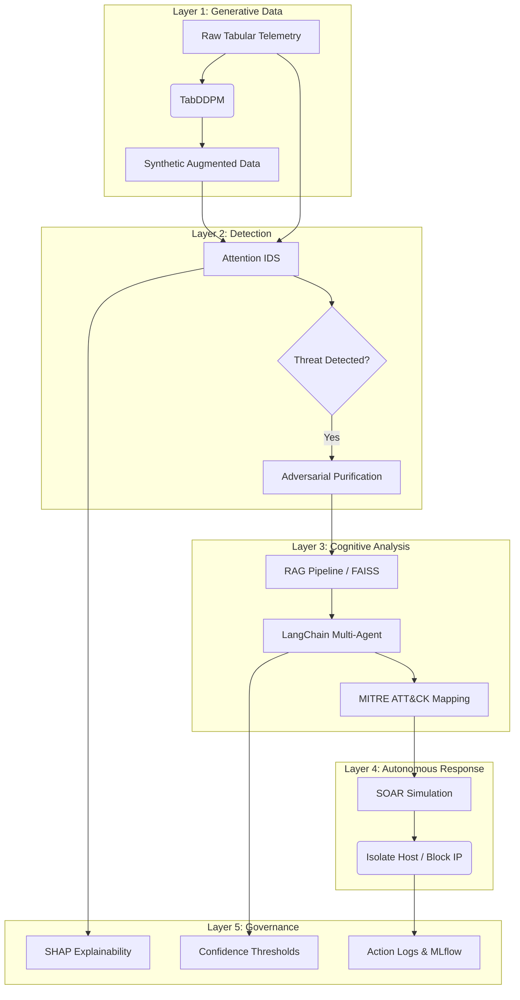

# 5-Layer Autonomous GenAI-Powered Cloud Defense Architecture

This repository contains the codebase for a 5-layer cloud-native cybersecurity framework leveraging Generative AI, designed for M.Tech dissertation research and suitable for high-tier academic conferences (e.g., NeurIPS, IEEE S&P).

## Architecture

The system consists of the following 5 layers:

1. **Generative Data Foundation:** Tabular Denoising Diffusion Probabilistic Model (TabDDPM) for synthesizing highly realistic intrusion datasets to solve data scarcity and class imbalance.
2. **Detection & Purification:** Attention-based Intrusion Detection System (IDS) trained with Focal Loss. Includes FGSM adversarial attack simulation and diffusion-based adversarial purification.
3. **Cognitive Analysis (RAG + Multi-Agent):** FAISS-backed Retrieval-Augmented Generation (RAG) mapped to the MITRE ATT&CK framework, utilizing a Decomposer and Supervisor multi-agent architecture (via LangChain).
4. **Autonomous Response:** Deterministic, SOAR-like executable response mapping directly synthesized by the LLM (e.g., isolating hosts, blocking IPs).
5. **Governance & Explainability:** SHAP feature attribution and confidence thresholds with full action trace logging via MLflow and custom JSON schemas.

### Architecture Diagram



## Setup Instructions

### Environment Setup

1. **Clone the repository:**
   ```bash
   git clone <your_repo_url>
   cd GAICS_Dissertation_v2
   ```

2. **Create a virtual environment (Optional but recommended):**
   ```bash
   python -m venv venv
   source venv/bin/activate
   ```

3. **Install dependencies:**
   ```bash
   pip install -r requirements.txt
   ```

### Dataset Preparation

### Dataset Preparation

This architecture strictly requires **Direct CSV Ingestion** of real cloud telemetry to prevent synthetic circular validation.

1. Download a subset of the **CIC-IDS-2018** dataset (e.g., `02-14-2018.csv` for SSH Bruteforce).
2. Place the file exactly at: `data/cicids_subset.csv`.
3. The loaders will automatically parse, drop non-numeric metadata, and preprocess the features.

## Execution

### Full Pipeline Reproduction
To run the full end-to-end pipeline (Data Loading -> TabDDPM Training -> IDS Training -> Evaluation):
```bash
python run_all.py
```

### Individual Components
- **Train DDPM:** `python -m training.train_ddpm`
- **Train IDS:** `python -m training.train_ids`
- **Run API Server:** `uvicorn api.fastapi_app:app --reload`
- **Run Benchmarks:** `python -m evaluation.benchmark`

### Google Colab Execution
For ease of execution and reproducing the results visually:
1. Upload this folder to Google Drive or push it to GitHub.
2. Open `Colab_Demo.ipynb` in Google Colab.
3. Select a **T4 GPU** runtime.
4. Run all cells to install dependencies and execute the pipeline natively within the notebook.
